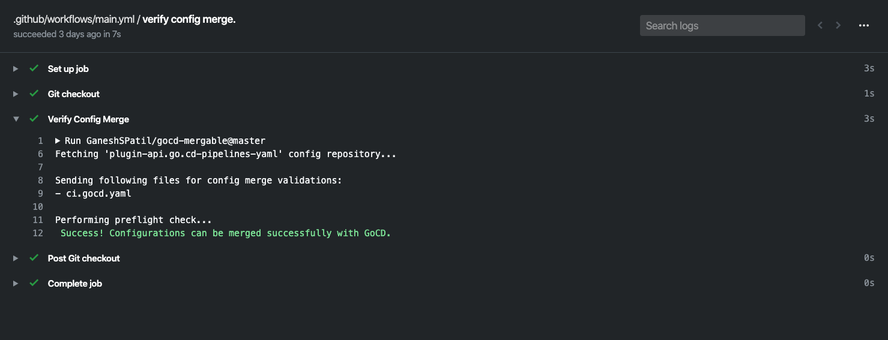
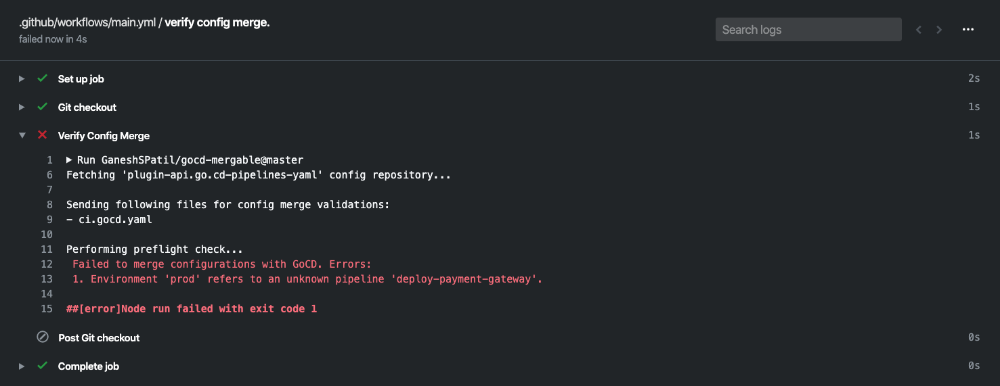

# 🚀 GoCD mergeable - Github Action

[](https://travis-ci.org/GaneshSPatil/gocd-mergeable)
[](https://coveralls.io/github/GaneshSPatil/gocd-mergeable)
[](https://greenkeeper.io/)

A Github Action for verifying changes done to the GoCD config repository. 

On every check-in or a pull request, GoCD mergeable action verifies whether modifications done to the GoCD configuration files are valid or not by performing the [GoCD preflight check](https://api.gocd.org/current/#preflight-check-of-config-repo-configurations) on the specified config repository.  


## Usage

See [action.yml](https://github.com/GaneshSPatil/gocd-mergeable/blob/master/action.yml) For comprehensive list of options.

#### Basic 

*Note:* Do not specify `GOCD_ADMIN_ACCESS_TOKEN` as a plain text value. 
Use [Github Secrets](https://help.github.com/en/actions/automating-your-workflow-with-github-actions/creating-and-using-encrypted-secrets) for specifying the secret access token.

```yaml
on: [push]

jobs:
  verify_config_repository:
    runs-on: ubuntu-latest
    name: verify config repository changes
    steps:
      - name: Git checkout
        uses: actions/checkout@v2
      - name: Verify Config Merge
        uses: GaneshSPatil/gocd-mergeable@v1.0.0
        with:
          GOCD_SERVER_URL: 'https://gocdserverurl.com/go'
          GOCD_ADMIN_ACCESS_TOKEN: ${{ secrets.GOCD_ADMIN_ACCESS_TOKEN }}
          GOCD_CONFIG_REPOSITORY_ID: 'config-repo-id'
```

#### Validate on pull requests

```yaml
on: [pull_request]

jobs:
  verify_config_repository:
    runs-on: ubuntu-latest
    name: verify config repository changes
    steps:
      - name: Git checkout
        uses: actions/checkout@v2
      - name: Verify Config Merge
        uses: GaneshSPatil/gocd-mergeable@v1.0.0
        with:
          GOCD_SERVER_URL: 'https://gocdserverurl.com/go'
          GOCD_ADMIN_ACCESS_TOKEN: ${{ secrets.GOCD_ADMIN_ACCESS_TOKEN }}
          GOCD_CONFIG_REPOSITORY_ID: 'config-repo-id'
```

#### Trigger validation only when configurations changes

GoCD's pipeline as code allows the pipeline configurations to be defined where the source is (same git repository).
But we often don't make changes to the pipeline configurations and thus can avoid GoCD mergeable bot check by whitelisting the config files. 

```yaml
on:
  push:
    paths:
    - '.gocd/*.gocd.yml'
    - '.gocd/*.gocd.yaml'

jobs:
  verify_config_repository:
    runs-on: ubuntu-latest
    name: verify config repository changes
    steps:
      - name: Git checkout
        uses: actions/checkout@v2
      - name: Verify Config Merge
        uses: GaneshSPatil/gocd-mergeable@v1.0.0
        with:
          GOCD_SERVER_URL: 'https://gocdserverurl.com/go'
          GOCD_ADMIN_ACCESS_TOKEN: ${{ secrets.GOCD_ADMIN_ACCESS_TOKEN }}
          GOCD_CONFIG_REPOSITORY_ID: 'config-repo-id'
```

## Output

1. Following is an example of successful GoCD mergeable run, when the config repository configurations are valid and can be successfully merged with GoCD.



2. Following is an example of failed GoCD mergeable run, when the config repository configurations has some errors (and/or is invalid).

 

## A note about security

GoCD mergeable Github Action when enabled for [GoCD groovy DSL plugin](https://github.com/gocd-contrib/gocd-groovy-dsl-config-plugin), will evaluate untrusted code on the GoCD server. As evaluating the groovy code in a sandbox is currently a work in progress for groovy plugin.

Enabling GoCD mergeable Github Action for pull requests on a groovy config public repository can allow a malicious Github user to do significant damage by running a script as part of the pull request that steal keys and secrets, remove files and directories, install malware, etc on the GoCD Server.  

It is recommended to configure GoCD mergeable Github Action to be executed only on trusted check-ins. 

## Example

Checkout GoCD mergeable YAML Example [master](https://github.com/GaneshSPatil/gocd-mergeable-yaml-example) branch and [pull request](https://github.com/GaneshSPatil/gocd-mergeable-yaml-example/pull/1) for live examples.

## License

GoCD mergeable is an open source project, under the [Apache License, Version 2.0](https://www.apache.org/licenses/LICENSE-2.0).

## Contributions
Contributions are welcome! See [Contributor's Guide](contributors.md)
